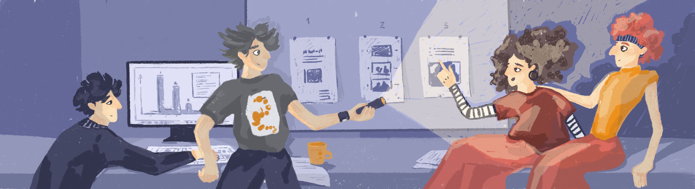

# Presentation

Разработка презентации приложения

## Contents

1. [Chapter I](#chapter-i) \
   1.1. [Intro](#intro)
2. [Chapter II](#chapter-ii) \
   2.1. [Task Presentation](#task-presentation)
3. [Chapter III](#chapter-iii) \
   3.1. [Part 1. Презентация](#part-1-презентация)  
   3.2. [Part 2. Подготовка демонстрации](#part-2-подготовка-демонстрации)  
   3.3. [Part 3. Bonus](#part-3-bonus)

# Chapter I

## Intro

Выматывающие 4 дня разработки позади, настало время подготовиться к представлению полученных результатов. Конечно, они
еще далеки от идеала, и много вещей хотелось бы переделать (не считая огромного списка нереализованных фич), но совсем
скоро улетать домой, а порадовать в-ра сделанным тикетом очень хочется (уж больно много сил было уже вложено в эти
задачи).  
По опыту, вы знаете, что хорошая презентация — это зачастую не менее важно, чем сам факт успешного выполнения проекта.
Подготовка презентации — это сложная многофакторная задача — необходимо выделить основное, про что следует рассказать и
сфокусироваться на этом (никто не будет слушать презентацию длиннее 5 минут), подготовиться к неудобным вопросам и
продумать демонстрацию (в том числе с учетом всех “недоделок”).

# Chapter II

## Task Presentation

Разработку презентации вы так же, как и остальные блоки задач декомпозировали на последовательность подзадач, назначили
ответственных - и нырнули в новый этап работы. Учтите, что на всю защиту будет не больше 10 минут: 5 минут на презентацию, 2 на демонстрацию проекта и 3 на ответы на вопросы.

# Chapter III

*Замечание:* Не забудьте перед началом работы перенести папку src из второго проекта!

## Part 1. Презентация

Перечислены задачи по формализации и разработке слайдов презентации. Каждой задаче может соответствовать от 1 до 3
слайдов. Помните, что у вас всего 5 минут.

| Задача | Артефакт                                            | Рекомендации |  
|--------|-----------------------------------------------------|--------------|  
| 1.1. Слайд с названием команды и названием бота | Презентация   *src/presentation/presentation.** | -=no comments=- |
| 1.2. Проблема и актуальность | Презентация   *src/presentation/presentation.** | Описание проблемы и актуальности |
| 1.3. Существующие решения  | Презентация   *src/presentation/presentation.** | Анализ существующий решений | 
| 1.4. Постановка задачи | Презентация   *src/presentation/presentation.** | IDEF0 + ограничения |  
| 1.5. Предлагаемое решение | Презентация   *src/presentation/presentation.** | Use case diagram, ERD |  
| 1.6. Архитектура и технологический стек | Презентация   *src/presentation/presentation.** | Архитектурное решение, диаграмма компонентов, технологический стек |
| 1.7. Состав команды и план разработки | Презентация   *src/presentation/presentation.** | -=no comments=- |
| 1.8. Особенности реализации | Презентация   *src/presentation/presentation.** | Любые особенности, которые вы считаете интересными. Алгоритмы, архитектурные и технологические решения, решения в области UI/UX или бизнес-логики системы |
| 1.9. UI/UX  | Презентация   *src/presentation/presentation.** | Макеты и их реализация или описание UI на командах | 
| 1.10. План развития и внедрения | Презентация *src/presentation/presentation.** | Продумайте в числе прочего шаги, которые отделяют ваш прототип от промышленного использования |  

## Part 2. Подготовка демонстрации

| Задача | Артефакт | Рекомендации |  
|--------|---------|--------------|  
| 2.1. План демонстрации | План демонстрации   *src/presentation/demo.md*  | Продумайте, как продемонстрировать ваше решение за 2 минуты так, чтобы ни у кого не осталось сомнений, что это лучший бот в галактике |

## Part 3. Bonus

| Задача                 | Артефакт                                                                        | Рекомендации    |  
|------------------------|---------------------------------------------------------------------------------|-----------------|  
| 3.1. QR-код для мгновенного доступа к боту | Презентация   *src/presentation/presentation.** | -=no comments=- |
| 3.2. Рекламный ролик проекта | Презентация (добавлена ссылка на ролик)   *src/presentation/presentation.** | Ролик в 30 секунд, рекламирующий вашего бота для запуска по всем кампусам галактики. |
