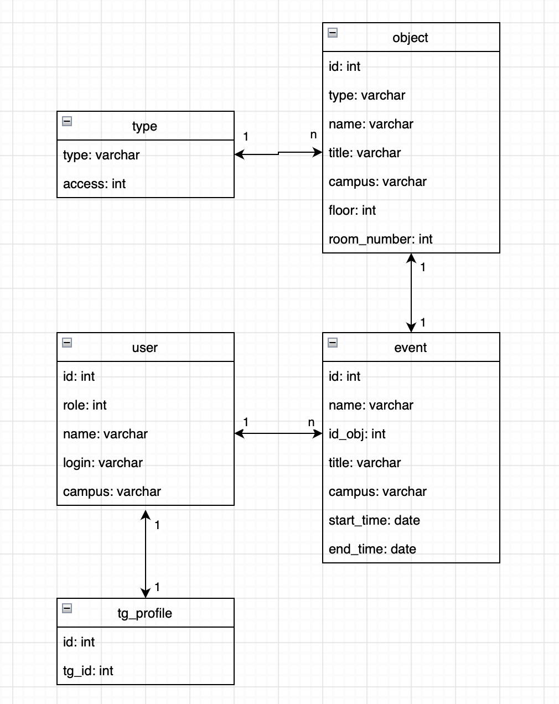

## 2.5 Проектирование БД

### На текущем этапе проектирования база данных выглядит следующим образом:

Задействованы 5 таблиц:
- **type** (type, access)
- **object** (id, type, name, title, campus, floor, room_number)
- **event** (id, name, id_obj, title, campus, start_time, end_time)
- **user** (id, role, name, login, campus)
- **tg_profile** (id, tg_id)

