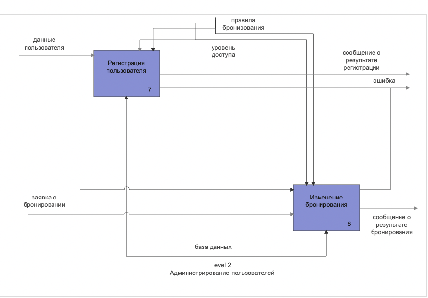

## 1.6 Формализация постановки задачи

Для нашей работы была спроектирована диаграмма IDEF0, показывающая логические отношения между процессами.

### 1.6.1 level 0. Бронирование объектов через bookbot.

**Входной информацией являются:**
- Данные пользователя
- Тип брони
- Дата и время брони

**Выходной информацией являются:**
- Сообщение о результате регистрации
- Сообщение о результате бронирования
- Ошибка

**Механизмами информации являются:**
- База данных

**Управляющие информацией системы являются:**
- Уровень доступа 
- Правила бронирования

### 1.6.2 level 1. Декомпозиция бронирования объектов через bookbot.

Мы декомпозировали общий блок "Бронирование объектов через bookbot на связанные между собой элементы.

**В нашем случае декомпозиция разделилась на 2 этапа:**
- Бронирование
- Администрирование пользователей

### 1.6.3 level 2.1. Декомпозиция блока "Бронирование".

Мы декомпозировали общий блок "Бронирование" на связанные между собой элементы.

**В нашем случае декомпозиция разделилась на 3 этапа:**
- Создание заявки о бронировании
- Редактирование брони
- Оценка статуса бронирования объектов

### 1.6.3 level 2.2. Декомпозиция блока "Администрирование пользователей".

Мы декомпозировали общий блок "Администрирование пользователей" на связанные между собой элементы.

**В нашем случае декомпозиция разделилась на 2 этапа:**
- Регистрация пользователей
- Изменение бронирования
